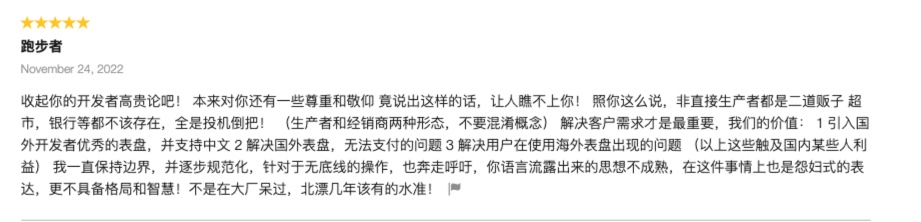

# 劝退帖: 快逃, 这个平台不值得

你应该远离佳明开发的若干理由

## 免费派

如果你开发只图一个乐呵, 都是免费应用, 大侠志趣甚是高雅

### 无休止“联系开发者”

如果你的应用非常不错, 用户就会不断骚扰你让你支持他的机型.是支持还是不支持?

也许用户遇见了 bug 会不断给你发“你好,在吗?”

简单点,说话的方式简单点, 递进的情绪请省略?

当你回复时, 石沉大海, 杳无音讯

再或许用户稍稍开门见山, 问“怎么用不了?”

“鸟何萃兮苹中，罾何为兮木上” 一点细节没有, 我咋知道

总之, 你会收到报告问题的大量邮件, 但是大量用户并不知道怎样正确地问一个问题, 你会很疲惫

### 无休止的 bug 报告,经常论坛考古

即便你的代码再完善, Connect IQ 总能让你遇到各种各样的 bug, 也许是 sdk bug, 也许是机型的固件 bug, 甚至是突然就产生了 bug.

幸运的是你能通过检查代码发现某些地方写错了.

不幸的是,你需要去论坛里搜索, 也许搜不到, 也许找了半天发现多年前悬而未决, 然后你在沉寂的 thread 中问了一声, “Sir, any progress now?”. 然后多年前就已经 58 岁了的 jim 大叔,和深邃高冷的 FlowState 等众网友会热心地告诉你, 什么是 bad pattern, 用一个什么样的 workaround 能够规避这个 bug.

就像安卓碎片化一样, 佳明的碎片化更甚. 不同的机型定位,不同的 api,屏幕尺寸,字体族, 平台**都没有**给你抹平,自己想办法兼容吧.

## 付费派

谈钱不可耻. 谈钱意味着责任, 意味着更好的服务. 如果你开发付费应用, 很好, 恭喜你, 发动了“需要支付”技能, 劝退了大量只看免费应用的用户, 能减少不少的用户咨询. 但是有如下劝退理由:

### 收入微薄, ROI 太低

挣不了几个钱, 屁事很多. 如果你是挣点可乐钱, possible

### 收费困难

应用商店没有集成提供支付方式, 收款? 自己想办法? 微信、支付宝、paypal

### 庙小妖风大,池浅王八多

应用商店充斥着虚假广告以及排名操纵, 如果你想来玩类似套路, 我劝你不要来了, 不然你会收到中国开发者的铁拳, 会吃佳明或者我司律师函.

大约是 2021 年年中开始有了某渊的公众号**佳明宝典**(曾用名,跑步了,天气开发等, id 是 tianqikaifa), 他玩的套路是利用中国大陆用户访问不了 OWM(天气 api 服务商), 在公众号用打赏的名义销售此 api key, 无本万利. 显然是违反了 OWM 的使用协议的. 当然 OWM 懒得管.

大约是 2022 年三四月份,来了一个 KCN, 注册了 garmin.cc, 试图让人误以为与佳明发生一些什么联系(他的客服,也就是他自己吧,叫小佳, 真机智). 他的套路是用**佳明运动营**代理国外开发者的表盘应用, 转手卖给中国的用户. 后来某渊如法炮制, 不知道是谁开了先河.

当然代理销售毫无问题, 没有下限的事情来了, 他们开始定期在应用商店各个火热的应用下发布引流的广告, 有时候是他们亲自下场,有时候是机器人, 有时候是胁迫用户(否则不给 api key). 然后他们相继在应用商店 trending app 里面树立代理应用作为黄金广告位, 一直刷, 有时怕被发现, 刷了定时删除重新刷,骗过 rank 算法.

2022 年 11 月份期间 yp 这位开发者也许是不堪忍受这种下作手段, 如法炮制了, 在水哥(不知道你是哪位开发者真身, 联系我,敬你是条好汉, 交个朋友)的痛骂下住手了, 知耻近乎勇, 说明他还有良知.

这个 KCN, 佳明运动营就比较死硬了, 我决定和他死磕, 我把 GRun 中文版名字加上了他的两个代理应用是刷出来的好评之类的后缀, 就这样一直放着吧, 让你享受所有 Connect IQ 用户的开屏凝视.

https://li2niu.com/spamreviews

> 收起你的开发者高贵论吧！ 本来对你还有一些尊重和敬仰 竟说出这样的话，让人瞧不上你！ 照你这么说，非直接生产者都是二道贩子 超市，银行等都不该存在，全是投机倒把！ （生产者和经销商两种形态，不要混淆概念） 解决客户需求才是最重要，我们的价值： 1 引入国外开发者优秀的表盘，并支持中文 2 解决国外表盘，无法支付的问题 3 解决用户在使用海外表盘出现的问题 （以上这些触及国内某些人利益） 我一直保持边界，并逐步规范化，针对于无底线的操作，也奔走呼吁，你语言流露出来的思想不成熟，在这件事情上也是怨妇式的表达，更不具备格局和智慧！不是在大厂呆过，北漂几年该有的水准！

来, 我们分析下他的这条 review.

> 本来对你还有一些尊重和敬仰 竟说出这样的话，让人瞧不上你！

用语真 low. 上来给我先戴个高帽子, 先捏造出个不存在的东西倒打一耙污蔑成我先来攻击他试图狡辩成他在正当防卫一样, 然后他作恶践踏别人的劳动成果就变得理所当然。

> 照你这么说，非直接生产者都是二道贩子 超市，银行等都不该存在，全是投机倒把！

法无禁止即自由, 这是你的自由和权利, 应该被尊重.

> 解决客户需求才是最重要，我们的价值： 1 引入国外开发者优秀的表盘，并支持中文 2 解决国外表盘，无法支付的问题 3 解决用户在使用海外表盘出现的问题 （以上这些触及国内某些人利益）

确实,你们有价值. 看看评论区的真实评价, 你做的什么玩意, 利欲熏心, 眼里只有钱.

> 我一直保持边界，并逐步规范化，针对于无底线的操作，也奔走呼吁，
> 你保持的边界是定时删除评价吧定时刷上评价吧. 你就是最没底线的人. 你奔走呼吁是因为你的 top1 被抢走了.

> 你语言流露出来的思想不成熟，在这件事情上也是怨妇式的表达，更不具备格局和智慧！不是在大厂呆过，北漂几年该有的水准！

哈哈, 再度开始扣帽子、人身攻击, 狗咬人怎么能再咬回去, 你就也只能用人身攻击来满足可怜的自尊心了. 咱老李来自农村, 向来没有格局和智慧, 就喜欢骂人. 本人前司确实是五百强公司,不过最菜逼的, 即便如此, 要锤也能把你捶死, 让你在应用商店无立锥之地. 你的水平挺高的,太有格局和智慧了, 真不愧是福州医科大学毕业的医学生.

为什么我不能忍? 是可忍孰不可忍, 草泥马, 不好意思我爆粗了. 评价体系是公正的, 每个开发者都有竞争到 trending apps 的权利, 你疯狂刷好评,草泥马, 我辛辛苦苦写代码, 其他开发者辛辛苦苦写代码, 凭什么你来刷评价占据榜首, 攫取流量果实.

你凭什么, 凭你阴谋诡计? 凭你下作无底线? 你配钥匙吗? 你配? 你配几把? 你不配? 那你快滚吧

> 雷锋同志说过：“对待同志要像春天般温暖，对待工作要像夏天一样火热，对待个人主义要像秋风扫落叶一样，对待敌人要像严冬一样残酷。”

这些心术不正, 玩弄手段的开发者是所有兢兢业业创作的开发者的敌人, 锤他, 请勿手软.

## 免费付费都会遇到的问题

### 上面的虚假评论总会影响到你

如果你在乎应用的排名, 免费应用获取被关注的成就感;付费应用直接关乎经济利益.

黄钟毁弃,瓦釜雷鸣.无论哪种情况, 这种破坏市场的行为都是极为令人挫败的.

不要手软, 用你能用的社交媒体曝光他们, 让用户了解事实真相, 他们自会评判.

### 高效节约的代码 = 反设计模式

在这里, 你最好不要用 const, 不要用 enum, 最好多用 magic number, 最好少封装方法. 是不是反设计模式了? 没错,由于早期设备的空间限制(也许是芯片架构问题), 开发者可编程空间非常有限, 通常不超过 1M, 多数设备还是 91kB, 注意看是 kB, 为了写出节约内存的高效代码, 你必须竭尽所能地让代码“面目全非“. 当然你有办法增强可读性, 那就是在 magic number 后面加上清晰的注释.然而严格说来说这只是注释的可读性, 而非代码可读性. 你可以在论坛中搜索 reduce memory 查找相关的 thread 来考古这种“抠门大师”是牺牲可读性来节约内存的.

### 你需要很多技能, 做厨子, 从农夫开始, 从种菜劈柴生火开始

让我细数一下做一个表盘需要会的技能

#### 低配版

- monkeyc, 这个倒是最简单的
- 良好的听说读写英语, 你要和国外论坛开发者以及用户交流
- 英语论坛检索能力, 查资料对 debug 太重要了
- 简单设计能力
- 产品能力, 付费应用肯定是以利润为导向, 怎样的应用最有市场就要看你的产品力了

#### 高配版

- 作图, 设计稿、改图标、做宣传图片都需要
- 动画制作, 如果你要做动画版本, 很必要
- 脚本语言, 用脚本语言写一个构建、工作脚本能提高很多效率
- 字体制作, 自定义字体能一定程度上保证不同机型上体验的统一和不同类型设备的兼容
- 宣传, 写文档、做宣发
- 客服, 拿人钱财,替人消灾, 真正想做好付费应用就必须更加用心和负责
- 网站建设能力, 如果你想做自动化购买支付, 服务端前端得有吧

## 总结

上述我谈到几点劝退的理由, 这个平台机型配置参差, 碎片化严重, 用户心智方差太大, 对耐心、精力考验很大; 收钱困难, 额外花费精力; 兴风作浪的烂人,劣币驱逐良币可能让你每天都犯恶心;需要技能树太多, 这对于个人来说需要额外花很多时间.

如果你只是图一乐呵,上述劝退问题作用立刻减弱很多;
如果你想来以此为业, 劝你放弃, 不如好好上班,或者去 ios 或者安卓平台.
如果你是学软件工程的, 我倒觉得作为一个以盈利为目的项目开始来进行团队协作训练是很不错的,工程不大,但是需要的工种不少,挣到一顿结课大餐钱并不是难事;
LBNL, 如果你想玩上面反例那一套, 劝你放弃, 在我退出之前, 一定把律师函寄给你, 更重要的是, 其他开发者也不会放过你,不想名声臭掉, 爱惜你的羽毛.
