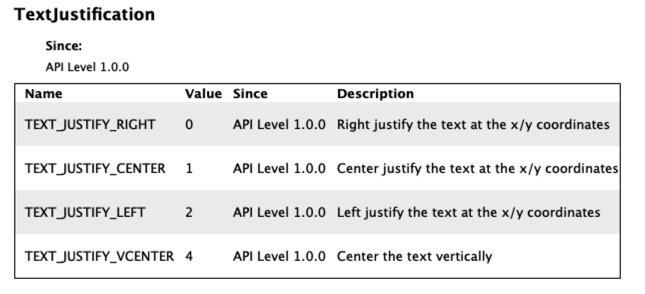

# Draw 系列方法

draw 系列方法是[Dc 类](https://developer.garmin.com/connect-iq/api-docs/Toybox/Graphics/Dc.html)下的一系列方法, 用于绘制图形、字体、bitmap 等

刚开始时花了很久才明白 drawText 方法的对齐方式和 drawBitmap 的坐标用法是怎么回事,理解后发现如此简单,现在分享给 newbies

主要讨论 drawText 和 drawBitmap 两个方法

## drawText

方法声明
drawText(x as Lang.Numeric, y as Lang.Numeric, font as Graphics.FontType, text as Lang.String, justification as Graphics.TextJustification or Lang.Number) as Void

### 先了解下字体的相关参数


在 Connect IQ 的 sdk 中,我们可以找到 descent 和 ascent 相关的一些 api,这些 api 获取的数据也正是图上演示的距离.
对于系统字体来说, 数字字体的 ascent 和 descent 可以不考虑,几乎是零. 但是对于 fr935 这类设备的字体会有一些特别, 比较高, 注意区别对待下.因为我常用自定义字体,所以对我无法造成影响.

ascent 和 descent 这两个参数是字体的固有属性, 我们可以在生成 bitmap 的时候进行微调,至于怎么调? 我通常是修改 .fnt 文件中的字体 baseline 以做一些统一调整.

为什么要提 ascent 和 descent?

因为如果在绘制的时候不考虑这个因素,你会发现字体实际的位置和想象中的可能不一样, 如果不了解到字体有这两个参数, 问题会困扰很久. 最初我也是因为不明白这两个参数,还以为是对齐方式理解错了, 走了很多弯路.

### 对齐方式

对齐方式的四种 TextJustification


因为混合着字体的 ascent 和 descent 属性, 这是曾经是最令我疑惑的点,但是在理解到了字体的固有属性以后,这一切都迎刃而解了.

但是还是有一些需要注意的点.

Sdk 中提供了 4 种对齐方式,还有一种是缺省值、默认的向上对齐, 水平方向三种,居中(我们提供的 x 坐标将会是绘制的字体的水平中点),靠左(我们提供的 x 坐标将会是绘制的字体的左边线坐标),靠右(我们提供的 x 坐标将会是绘制的字体的左边线坐标);垂直方向两种,一种是向上对齐(缺省值),一种是居中对齐.

所以根据排列组合, 这些对齐方式最多有 6 种组合.(为啥没有向下对齐,我不明白).

水平对齐方式和垂直对齐方式使用逻辑或 `|` 来组合起来.

举个例子吧:

```js
drawText(
  120,
  120,
  Graphics.FONT_SMALL,
  "HUST",
  Graphics.TEXT_JUSTIFY_VCENTER | Graphics.TEXT_JUSTIFY_LEFT
); //垂直居中,水平靠左
drawText(120, 120, Graphics.FONT_SMALL, "HUST", Graphics.TEXT_JUSTIFY_RIGHT); //垂直靠上,水平靠右
```

## drawBitmap

只需要记住一句话, (x,y)是图片左上角的坐标.
